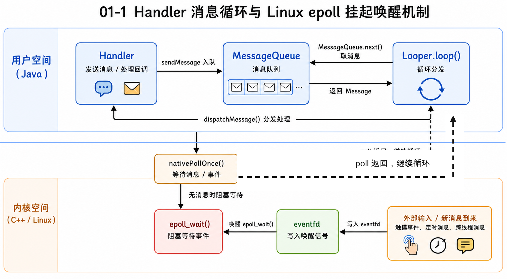
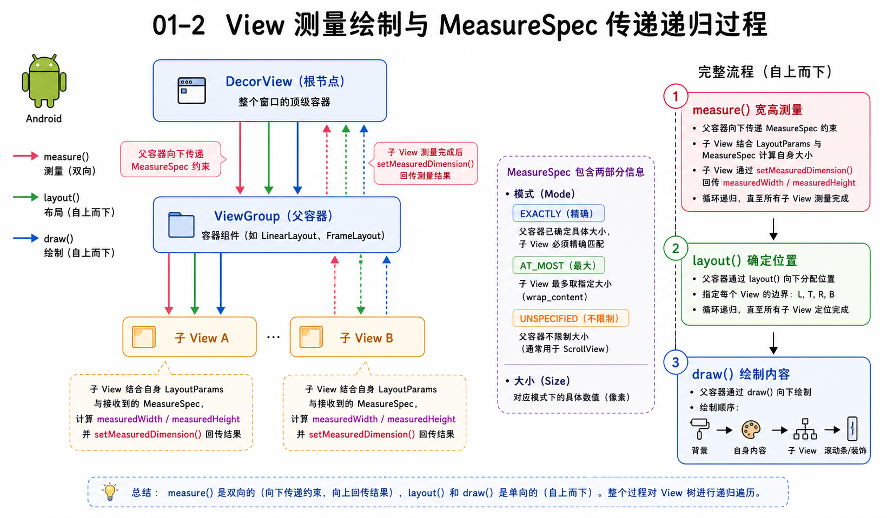
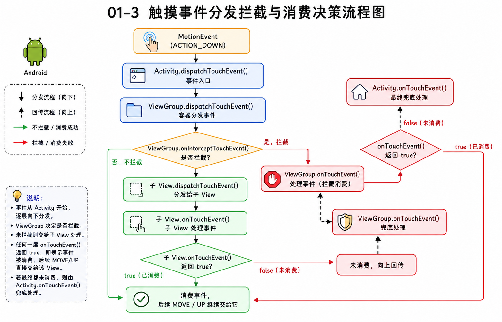
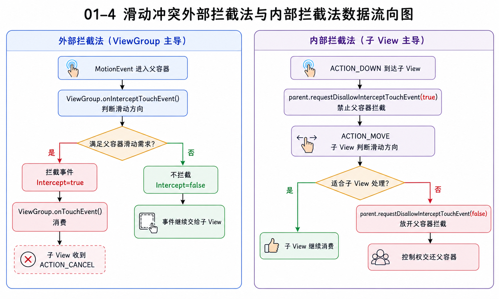

> **优先级：🔴 最高（高频 + 当前最弱）**
> 这三个子点经常在同一轮面试里连环出现。你的瀑布流经历天然涉及事件分发冲突，但 Handler 机制和 View 绘制流程是你目前最薄弱的环节，需要从原理层面建立认知。

---

## 核心原理讲解

> 💡 下面的文字是按照"面试时你可以这样跟面试官说"的口吻写的。不是让你背，而是让你读完之后能用自己的话复述出来。

### Handler/Looper/MessageQueue 是怎么协作的？

你可以把 Android 主线程想象成一个**永不停歇的流水线工人**。Looper 是这个工人的循环节奏——它不断地从 MessageQueue（任务队列）里取出 Message，交给对应的 Handler 去处理。

关键问题是：**Looper.loop() 是个死循环，为什么不会卡死主线程？** 这里的核心在于 MessageQueue 底层用的是 Linux 的 `epoll` 机制。当队列里没消息时，主线程并不是在空转消耗 CPU，而是**挂起等待**（阻塞在 `nativePollOnce` → `epoll_wait`）。一旦有新消息进来（比如用户触摸屏幕、系统回调），写端写入数据唤醒 epoll，Looper 就继续取消息处理。所以"死循环"只是逻辑上的循环，实际空闲时 CPU 占用为零。

### View 的 measure / layout / draw

三步走，层层递进：

- **measure**：从根 View 开始自顶向下递归。父 View 通过 `MeasureSpec`（= 测量模式 + 尺寸上限）告诉子 View "你最多能有多大"。三种模式：`EXACTLY`（你就是这么大）、`AT_MOST`（别超过这个值）、`UNSPECIFIED`（随便）。子 View 结合自身的 `LayoutParams` 算出自己的宽高。
- **layout**：在已知宽高的基础上，父 View 为每个子 View 分配具体位置（左上右下四个坐标 L, T, R, B）。
- **draw**：按顺序画——背景 → 自身内容 → 子 View → 装饰（如滚动条）。

一个实际的认知要点：**measure 可能被调用多次**。比如 `LinearLayout` 设了 `weight`，它会先测一遍子 View 原始尺寸，再按权重比例重新测一遍，所以复杂布局里 measure 调用次数会指数增长。

### 事件分发的三板斧

触摸事件从 Activity 一路往下传，核心就三个方法：

1. **`dispatchTouchEvent()`**：负责"分发"，每一层都有，决定事件往哪走
2. **`onInterceptTouchEvent()`**：ViewGroup 独有，决定"要不要在这层截胡"
3. **`onTouchEvent()`**：负责"消费"，真正处理触摸事件

分发链路：`Activity → Window → DecorView → ViewGroup → ... → 目标 View`

**核心规则**：如果某个 View 在 `ACTION_DOWN` 时 `onTouchEvent` 返回了 false（不消费），那后续的 MOVE、UP 就不会再给它了——系统会直接把事件回传给它的父容器处理。

处理嵌套滑动冲突有两种经典方案：
- **外部拦截法**：在父容器的 `onInterceptTouchEvent` 里判断滑动方向，决定是否拦截
- **内部拦截法**：子 View 调用 `parent.requestDisallowInterceptTouchEvent(true)` 先抢事件，再按需放手

---

## 桥接话术

> 面试中把知识点接到你的真实项目上，这样说：

"在我负责的 AI 图创 Feed 流里，瀑布流本身就是一个多层嵌套滚动容器的场景——外层有 CoordinatorLayout 的上滑吸顶，里面是双列瀑布流。我在处理嵌套滑动冲突时就直接用了事件分发的外部拦截法，根据滑动方向来判断拦截权。同时在做 Payload 局部刷新时，也需要理解 View 重新 measure/layout 的触发条件，确保只刷新变更的子 View 而不是整个 Item。"

---

## 高频追问 + 答题要点

### 追问 1：主线程 Looper 挂起之后，用户点击事件是怎么唤醒它的？

**要点框架**：
- 用户点击 → 硬件中断 → 内核驱动 → `InputDispatcher`（系统进程）
- `InputDispatcher` 通过 Socket 对（`InputChannel`）向应用进程写入事件
- 写入触发 MessageQueue 底层的 epoll 唤醒 → Looper 继续循环 → 分发处理

### 追问 2：自定义 View 的 onMeasure 不处理 wrap_content 会怎样？

**要点框架**：
- 不处理 `AT_MOST` 的话，`wrap_content` 的效果等同于 `match_parent`
- 原因：默认的 `View.onMeasure` 会直接取 `MeasureSpec` 里的 size 作为结果
- 正确做法：判断 mode 为 `AT_MOST` 时，取 `min(你的默认尺寸, specSize)` 再 `setMeasuredDimension`

### 追问 3：子 View 调了 requestDisallowInterceptTouchEvent(true)，父 View 的 ACTION_DOWN 还能被拦截吗？

**要点框架**：
- **能**被执行拦截判断。因为 ViewGroup 在分发 `ACTION_DOWN` 时会**重置** disallow 标志位
- 所以 disallow 机制只对 DOWN 之后的后续事件（MOVE、UP）生效
- 实践含义：父 View 如果想让子 View 优先收到事件，`ACTION_DOWN` 时必须自己主动不拦截

### 追问 4：你的瀑布流嵌套滑动冲突具体是怎么解决的？

**要点框架**：
- 外层 CoordinatorLayout 吸顶行为 vs 内层瀑布流纵向滑动
- 用外部拦截法：在父容器 `onInterceptTouchEvent` 中判断纵向位移大于横向时拦截
- 或通过 `NestedScrollingChild / Parent` 协议让内外层协商分配滑动距离

---

## 知识缺口提示

> ⚠️ 以下是结合你的背景，你最可能在这个知识点上被追问但答不上来的细节。

### 缺口 1：IdleHandler 是什么？什么场景用？

你可能没接触过 `MessageQueue.IdleHandler`。它是一个回调，在 MessageQueue 空闲时（没有待处理消息时）被触发。常见用途是在页面首帧渲染完成后再执行延迟初始化任务，比如预加载数据、上报埋点等。面试官问到 Handler 机制时经常顺带问这个。

### 缺口 2：同步屏障（SyncBarrier）

`ViewRootImpl` 在安排 View 绘制时，会往 MessageQueue 里插入一个**同步屏障消息**（target 为 null 的 Message）。插入后，Looper 取消息时会跳过所有普通同步消息，只处理异步消息。而 View 绘制的 `scheduleTraversals` 发出的就是异步消息，这保证了绘制任务的优先级高于其他普通 Handler 消息。绘制完成后屏障会被移除。

### 缺口 3：Compose 的测量模型差异

如果被问到 Compose，不需要深入但要能说出核心区别：Compose 的测量只进行**一次**（Single Pass），不允许子组件被重复测量。它用 `Constraints` 替代 `MeasureSpec` 向下传递约束，子组件返回 `Placeable` 向上汇报尺寸。这避免了传统 View 树在 `LinearLayout` + `weight` 等场景下多次 measure 的性能问题。
