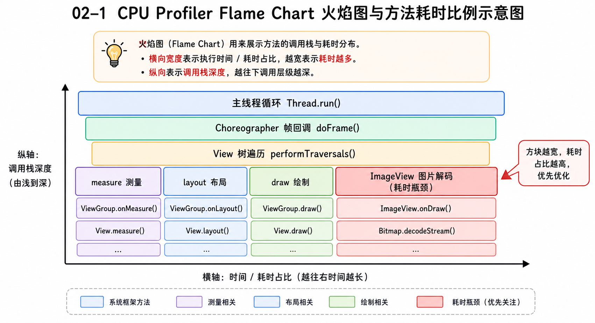
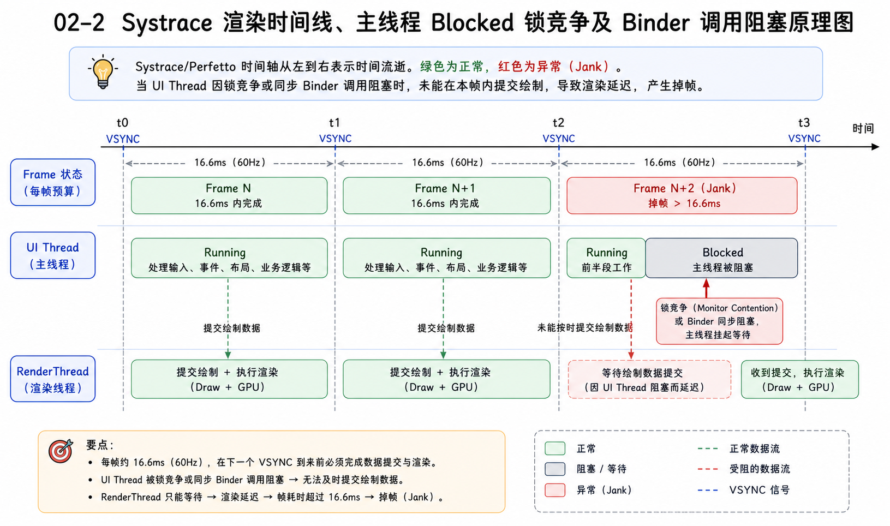
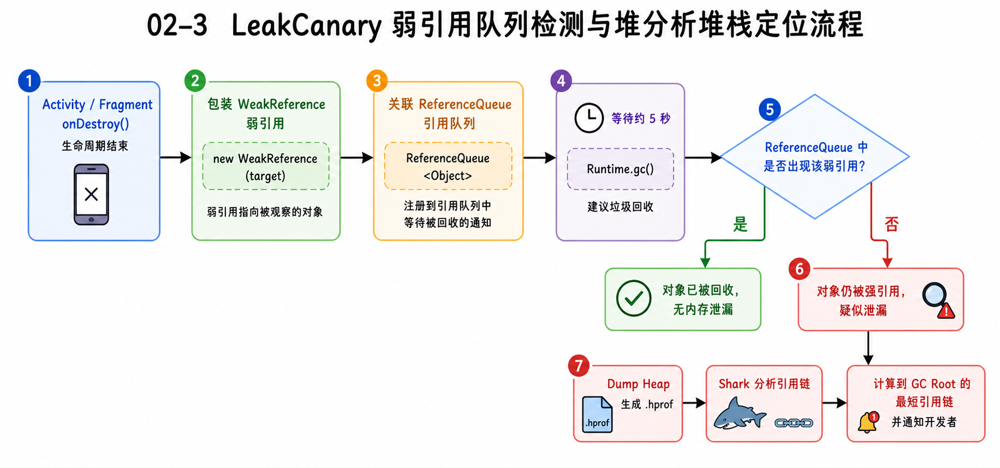
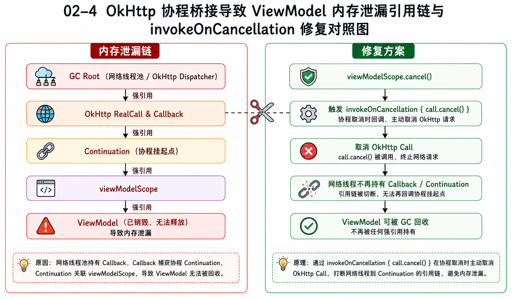

> **优先级：🔴 最高（高频 + 当前最弱，但有真实案例可用）**
> 很多候选人在性能优化上只能泛泛而谈，但你手头握有「协程内存泄漏排查」这个含金量极高的实战案例。这篇文档的核心目的，是帮你把这起排查经历，整理成一套可在面试中脱口而出的「黄金故事模板」，并补齐常用工具的底层细节。

---

## 核心原理讲解

> 💡 按照面试口语化表述，为你梳理核心工具的工作原理与排查思路：

### Android Profiler 怎么用？
在 AS 里，Profiler 主要分 CPU、Memory、Network 三大面板。
*   **CPU Profiler**：用来找卡顿和方法耗时。一般用 **Sampled（抽样）模式** 抓一段 Trace，生成火焰图（Flame Chart）。火焰图里越宽的方块代表这个方法执行时间越长，我们可以顺着它一层层往下看，找出最底层的耗时热点。

*   **Memory Profiler**：用来排查内存抖动和泄漏。在里面可以直接看实时分配的对象。如果发现内存曲线呈“锯齿状”高频起伏，说明有内存抖动（短时间内高频创建并销毁大对象，比如在 `onDraw` 里 new 对象或频繁拼接 String），这会引发高频 GC 导致卡顿。

### Perfetto / Systrace 的读图思路
它们是系统级的性能分析工具，基于 Linux 内核的 `ftrace` 机制。
*   **怎么读图**：抓出来的 Trace 是一个多轨时间线视图。首先看 **UI Thread** 和 **RenderThread**。如果发现某一帧超过了 16.6ms（60Hz）或 11.1ms（90Hz），对应的 Frame 轨道就会标红。
*   然后看主线程这一帧里在干什么。如果阻塞在 `monitor contention`（锁竞争）或进程间的 Binder 调用（`binder transaction`），那主线程就会被挂起（处于 Blocked 状态），这就是导致卡顿的真凶。如果是 `Choreographer#doFrame` 下面的 `performTraversals`（绘制三大流程）耗时过长，说明是布局太深或自定义 View 绘制太重。

### LeakCanary 的检测原理
可以用一句话概括：**弱引用关联引用队列 + 主动 GC 校验**。

1.  **自动检测销毁**：LeakCanary 注册了 Activity 和 Fragment 的生命周期监听。当它们执行 `onDestroy` 时，LeakCanary 会把这个销毁的对象包装成一个 `WeakReference`（弱引用），并关联一个 `ReferenceQueue`（引用队列）。
2.  **触发检测**：过 5 秒钟后，系统会收到检测通知。它先通过 GC 机制让对象去回收，然后检查 `ReferenceQueue`。
3.  **判断泄漏**：如果该对象的弱引用**没有**出现在 `ReferenceQueue` 里，说明这个已经被销毁的对象仍然被外界强引用着，判定为内存泄漏。
4.  **生成引用链**：判定泄漏后，LeakCanary 会在后台进程进行 `Heap Dump` 生成 `.hprof` 文件，利用 Shark 库分析堆内存，计算出泄漏对象到 GC Root 的最短路径引用链。

### 协程内存泄漏的常见模式
协程是用户态的，但它的挂起点是通过 `Continuation`（状态机）保存在堆上的。
如果一个协程的 `CoroutineScope` 生命期太长（比如滥用 `GlobalScope` 或把协程跑在了一个没有随 Activity/ViewModel 销毁而 cancel 的 Scope 里），那么这个挂起的协程就会一直留在内存中。它所持有的所有局部变量、外部类引用（比如 Activity 里的 UI 控件、ViewModel 实例）都会被这个 `Continuation` 强引用着，从而导致严重的内存泄漏。

---

## 桥接话术与实战模板

> 💡 针对你的「协程内存泄漏排查」真实案例，这里整理了一套完美的 STAR 叙述模板：

"在我们 AI 图创项目进行稳定性治理时，我通过 LeakCanary 监控，发现页面销毁后，ViewModel 无法被回收。我顺着引用链进行排查，**发现了一条调用链：OkHttp Callback → Continuation → viewModelScope → ViewModel**。

**它的定位过程是这样的**：
我发现在使用 `suspendCancellableCoroutine` 将 OkHttp 异步回调桥接转为协程挂起函数时，当用户快速退出页面，ViewModel 销毁，`viewModelScope.cancel()` 被触发。然而，此时底层的 OkHttp 网络请求还在后台运行，网络线程持有的 Callback 依然引用着挂起点的 `continuation`。因为请求没结束，回调没触发，这个 continuation 就释放不掉，从而顺着引用链把整个已销毁的 ViewModel 锁死在内存里。

**最后我的修复方案非常明确**：
1. 在 `suspendCancellableCoroutine` 中，使用 `continuation.invokeOnCancellation { call.cancel() }`。这样一旦协程生命周期取消，会立刻强行终止底层的 OkHttp 请求。
2. 在 Callback 的 `onResponse` 和 `onFailure` 回调逻辑入口，加上 `if (!continuation.isActive) return` 的活跃度状态守卫，避免往已经取消的挂起点继续 resume 传递数据。
修改后经过 LeakCanary 本地压测和线上发布观察，这类 ViewModel 内存泄漏问题被彻底解决。"

---

## 高频追问 + 答题要点

### 追问 1：TraceView 为什么不推荐用来测方法耗时？
*   **要点框架**：
    *   TraceView 采用的是 **Instrument（插桩）模式**，会在每个方法的入口和出口强行插入时间记录代码。
    *   这会带来极大的系统运行开销，导致测出来的函数耗时被严重放大（失真）。
    *   **替代方案**：通常用 CPU Profiler 的 **Sampled（抽样）模式**，或者直接用 Perfetto 配合自定义的 Trace Section。

### 追问 2：如果线上用户反馈卡顿，你又没有 Perfetto 可用，你怎么量化流畅度？
*   **要点框架**：
    *   通过 `Choreographer.getInstance().postFrameCallback()` 注册帧率监听。
    *   在回调的 `doFrame(frameTimeNanos)` 里，计算当前帧的时间戳与上一帧的差值。
    *   如果差值超过了 16.6ms（对于 60Hz 屏幕），差值除以 16.6ms 即可算出这一帧具体**掉了几帧**（Jank Count）。
    *   统计单位时间内的总掉帧率，并作为 APM 性能指标上报后台。

### 追问 3：在你的协程泄漏方案中，invokeOnCancellation 取消网络请求是在哪个线程执行的？
*   **要点框架**：
    *   它是在**触发协程取消（cancel）的那个线程**执行的（通常是主线程）。
    *   因为 OkHttp 的 `call.cancel()` 内部仅仅是修改了一个状态标志位并关闭 Socket，属于非阻塞的操作，因此在这个回调里执行是安全的，不会阻塞主线程。

---

## 当前知识缺口提示

*   > [!IMPORTANT]
    > **网络库配置细节**：面试官可能顺着 OkHttp 问你：“如果网络请求被取消了，连接池里的 TCP 连接会被关闭吗？”。答案是：**不会**。OkHttp 的连接池是复用机制，取消请求只是终止了当前的 Data Stream 传输，底层的 TCP Socket 连接仍会留在连接池里等待下一次复用（Keep-Alive 机制），直到连接超时（默认 5 分钟）才会被清理。
*   > [!WARNING]
    > **GC 机制防坑**：很多人以为调用 `System.gc()` 对象就会立刻回收。实际上，`System.gc()` 只是向 JVM **建议**进行一次 Full GC，至于系统什么时候真的执行、回不回收，是不可控的。LeakCanary 底层也是先通过多次触发 GC 建议，再等待数秒，才去确认弱引用是否被真正回收。
