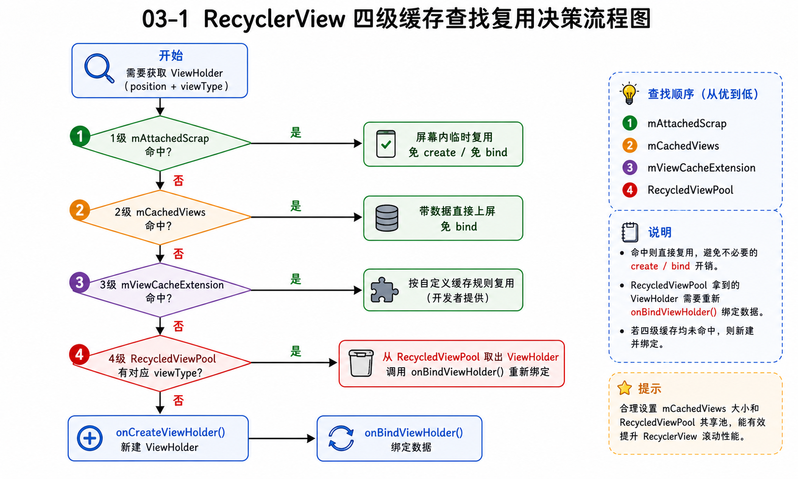
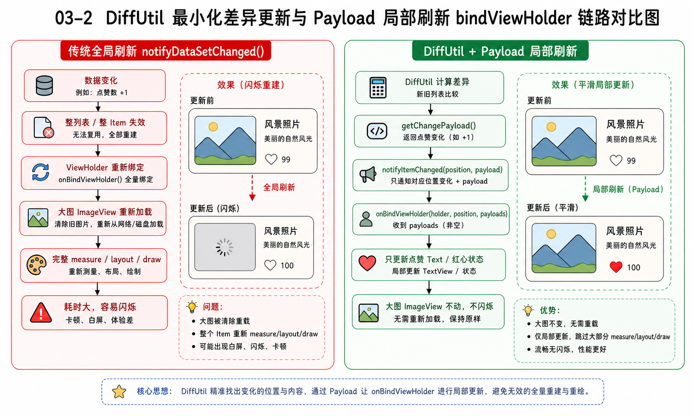
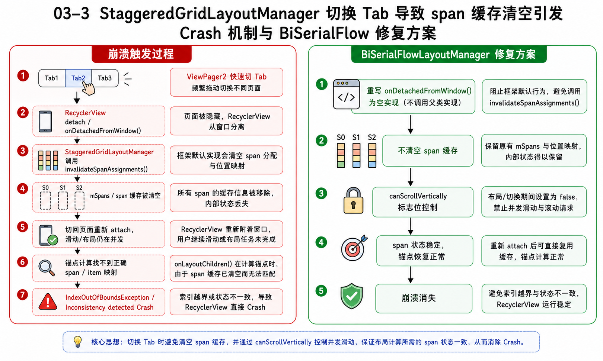

> **优先级：🟡 高（高频，且有实战经验可直接复用）**
> 面试官极爱深挖 RecyclerView。你拥有「Payload 局部刷新」和「瀑布流 StaggeredGridLayoutManager 闪退修复」的实战背景，这是你展示自己源码级解决问题能力的绝佳切入点。

---

## 核心原理讲解

> 💡 按照面试口语化表述，为你梳理核心机制的底层原理：

### RecyclerView 的四级缓存是怎么协同复用的？
你可以把四级缓存想象成四个不同级别的仓库，滑动的每一帧都在它们之间倒腾：

1.  **第一级：`mAttachedScrap`（屏幕内缓存）**
    *   **作用**：临时存放屏幕内正在显示的 ViewHolder。比如列表正在进行局部重新布局（局部刷新），它里面的 ViewHolder 结构没变，只是临时放进去，马上拿出来复用，**不需要重新 create 也不用重新 bind**。
2.  **第二级：`mCachedViews`（屏幕外一级缓存）**
    *   **作用**：默认容量只有 2 个。存放刚刚滑出屏幕的 ViewHolder。它最强大的一点是**连带状态和数据一起保存**。如果用户往回滑，直接命中这里，**零开销上屏（不 create，不 bind）**。
3.  **第三级：`mViewCacheExtension`（自定义扩展）**
    *   **作用**：开发者自定义扩展缓存，基本没人用，直接带过。
4.  **第四级：`RecycledViewPool`（跨 type 共享池）**
    *   **作用**：按 `itemViewType` 进行分组存储。滑出屏幕更远的、或者超出 `mCachedViews` 限制的 ViewHolder 会被丢到这里。丢进来时，它的数据和绑定状态会被清空。取出来复用时，**必须要执行 `onBindViewHolder` 重新绑定数据**。它可以被多个不同的 RecyclerView 共享。

### DiffUtil 原理与 Payload 局部刷新
*   **DiffUtil 的 Myers 算法**：`DiffUtil` 底层是用 Myers 差分算法计算两个数据集的差异，生成添加、删除、移动的最优最小步骤。
*   **Payload 局部刷新**：常规的 `notifyDataSetChanged` 会把整个 Item 甚至整个列表的 ViewHolder 彻底清空并重新 `measure/layout/draw`，导致界面闪烁和图片重新加载。通过在 `DiffUtil` 中实现 `getChangePayload(oldItem, newItem)`，我们可以只返回变化的具体字段（比如点赞数增加的属性）。更新时，调用 `notifyItemChanged(position, payload)`，这会触发三参数版本的 `onBindViewHolder(holder, position, payloads)`，在里面只给对应的 TextView 设置新文本，**不触发整个 ViewHolder 的重新测量和重新绘制，效率极高**。

### 瀑布流常见崩溃与不一致现象
原生 `StaggeredGridLayoutManager` 在复杂的列表滑动、多线程数据更新、快速切 Tab 时，经常会抛出 `IndexOutOfBoundsException: Inconsistency detected`。

根本原因在于：当 RecyclerView 正在进行滑动或并发布局计算时，如果 Adapter 的数据源被异步修改了，或者布局管理器保存的列状态（span）与当前真实的位置映射发生了错乱（比如切换 Tab 时缓存被强行清掉了），RecyclerView 的锚点计算就会指向一个不存在或已经被回收的 item，导致致命崩溃。

---

## 桥接话术与实战模板

> 💡 面试中如何将 RecyclerView 原理接到你的真实项目上：

"在我负责的 AI 图创 Feed 流中，由于我们的双列瀑布流图片卡片支持点赞和评论的实时状态同步，如果直接使用 `notifyDataSetChanged` 会造成整个 ViewHolder 重新绑定，导致卡片闪烁、图片重复加载，影响滑动性能。
我通过引入 **Payload 局部刷新**，在用户点赞时通过 `notifyItemChanged(position, NOTIFY_LIKE_CHANGE_TAG)`，只在带 payloads 参数的 `onBindViewHolder` 里更新红心状态和文本计数，绕过了图片的重复解码，保证了滑动流畅。

同时，针对瀑布流快速切 Tab 时高频抛出的原生 `StaggeredGridLayoutManager` 越界崩溃（崩溃率 0.05%），我通过**阅读源码发现其根因是 `onDetachedFromWindow` 会主动清空 mSpans 缓存**，导致 ViewPager2 快速重挂载时锚点丢失。
为此，我自研了 `BiSerialFlowLayoutManager`，通过空实现该方法保持了 span 缓存，并配合控制并发布局时的滑动禁止，成功将线上瀑布流的相关崩溃率直接归零。"

---

## 高频追问 + 答题要点

### 追问 1：既然有了 RecycledViewPool，为什么还需要 mCachedViews？
*   **要点框架**：
    *   `mCachedViews` 存放的是带数据的 ViewHolder，**命中时直接复用，不调用 `onBindViewHolder`**，开销为零。
    *   `RecycledViewPool` 存放的是被擦除数据的 ViewHolder，**命中时必须重新绑定数据，调用 `onBindViewHolder`**，有绑定开销。
    *   `mCachedViews` 是 RecyclerView 私有的；`RecycledViewPool` 可以跨 RecyclerView 共享。

### 追问 2：DiffUtil 的计算会有性能问题吗？怎么优化？
*   **要点框架**：
    *   有。当数据量非常大（比如上千条）且变化多时，Myers 算法在最坏情况下时间复杂度为 $O(N + D^2)$，在主线程执行依然会引起卡顿。
    *   **优化方案**：使用 `AsyncListDiffer` 或 `ListAdapter`，将数据集的比对计算（`calculateDiff`）全量丢到后台的协程/子线程中进行，比对完毕后再将更新指令派发回主线程更新 UI。

### 追问 3：多列瀑布流左右两列高度不一致，在快速滑动或刷新时卡片跳动，是什么原因？怎么解决？
*   **要点框架**：
    *   **原因**：StaggeredGridLayoutManager 在没有加载出图片真实高度前，会先用占位大小。图片加载完毕后尺寸变化，导致重新布局和 span 重新分配，产生“卡片对调”或“缝隙闪烁”的跳动。
    *   **解决办法**：后端返回数据时，必须下发图片真实的宽高比例；在布局中提前为卡片设定固定的宽高比例占位，避免图片加载前后卡片宽高突变。

---

## 当前知识缺口提示

*   > [!WARNING]
    > **数据源并发修改的坑**：面试官如果问：“如果在多协程里同时修改了 Adapter 背后关联的 `ArrayList` 数据源，会发生什么？”。答案是：**极大可能崩溃**。因为 RecyclerView 在测量布局时，会对比 `Adapter.getItemCount()` 和布局开始时的 Count。如果在两者之间主线程还没有收到 notify，而子线程已经修改了 List 大小，就会直接触发不一致崩溃。必须确保对数据源的所有增删改操作，都在同一个线程（主线程）中排队顺序提交。
*   > [!NOTE]
    > **Glide 图片加载防错位**：快速滑动时，ViewHolder 被高频复用。如果前一个 item 的图片还没下完，ViewHolder 就已经复用给下一个 item 了，可能会出现图片闪烁或错位。Glide 是通过给 ImageView 设置特定的 `Tag`（绑定当前的 Request）。当复用时，新的 bind 会触发新的请求，Glide 在发起新请求前会自动取消 ImageView 上的老请求并把占位图设为空，彻底防止错位。
